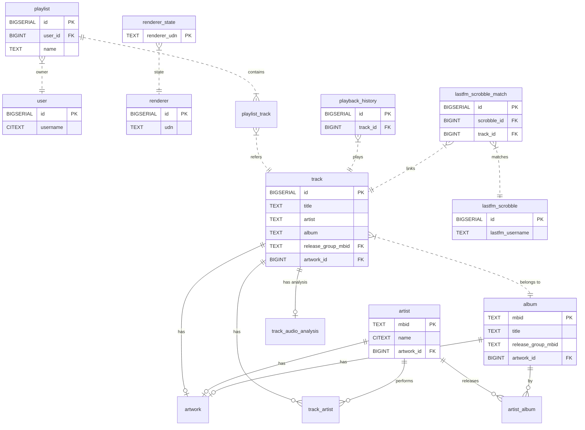

# Database Schema

The application uses a PostgreSQL database (running in Docker on port 8110).

## Extensions
- `citext`: Case-insensitive text matching (usernames, emails, artist names).
- `pg_trgm`: Trigram indexes for fast fuzzy searching.

## Entity Relationship Diagram (simplified)

## Tables

### `track`
Stores metadata for individual audio files.

| Column | Type | Description |
| :--- | :--- | :--- |
| `id` | BIGSERIAL | Primary key. |
| `path` | TEXT | Absolute file path. Unique, not null. |
| `updated_at` | TIMESTAMPTZ | Timestamp of last update. Default: `NOW()`. |
| `title` | TEXT | Track title. |
| `artist` | TEXT | Track artist (raw tag). |
| `album` | TEXT | Album name. |
| `album_artist` | TEXT | Album artist name. |
| `track_no` | INTEGER | Track number. |
| `disc_no` | INTEGER | Disc number. |
| `release_date` | DATE | Release date (normalized). |
| `release_type` | TEXT | Normalized release type (Album, Single, etc.). |
| `release_type_raw` | TEXT | Raw release type from tags. |
| `release_date_raw` | TEXT | Raw release date string. |
| `release_date_tag` | TEXT | Original date tag value. |
| `duration_seconds` | DOUBLE PRECISION | Duration in seconds. |
| `codec` | TEXT | Audio codec. |
| `sample_rate_hz` | INTEGER | Sample rate in Hz. |
| `bit_depth` | INTEGER | Bit depth. |
| `bitrate` | INTEGER | Bitrate in bps. |
| `channels` | INTEGER | Number of audio channels. |
| `label` | TEXT | Record label. |
| `artist_mbid` | TEXT | MusicBrainz Artist ID. |
| `album_artist_mbid` | TEXT | MusicBrainz Album Artist ID. |
| `track_mbid` | TEXT | MusicBrainz Track ID. |
| `release_track_mbid` | TEXT | MusicBrainz Release Track ID. |
| `release_mbid` | TEXT | MusicBrainz Release ID. |
| `release_group_mbid` | TEXT | MusicBrainz Release Group ID. |
| `artwork_id` | BIGINT | Foreign key to `artwork.id`. |
| `size_bytes` | BIGINT | File size in bytes. |
| `quick_hash` | BYTEA | Partial hash for quick comparison. |
| `mtime` | DOUBLE PRECISION | Modification time. |
| `fts_vector` | TSVECTOR | Full-text search vector (title/artist/album). |

### `track_audio_analysis`
Stores locally derived audio analysis for tracks. Rows are invalidated when
`track.quick_hash` changes or the analyzer version increases.

| Column | Type | Description |
| :--- | :--- | :--- |
| `track_id` | BIGINT | Primary key. Foreign key `track.id`. |
| `track_quick_hash` | BYTEA | `track.quick_hash` value when analysis was run. |
| `analysis_version` | INTEGER | Analyzer version used for invalidation. |
| `status` | TEXT | `complete`, `error`, or transient job state. |
| `error` | TEXT | Last analyzer error, if any. |
| `analyzed_at` | TIMESTAMPTZ | Last successful analysis timestamp. |
| `phase1_analyzed_at` | TIMESTAMPTZ | Phase 1 analysis timestamp. |
| `phase2_analyzed_at` | TIMESTAMPTZ | Phase 2 analysis timestamp. |
| `phase3_analyzed_at` | TIMESTAMPTZ | Phase 3 analysis timestamp. |
| `phase4_analyzed_at` | TIMESTAMPTZ | Phase 4 analysis timestamp. |
| `loudness_lufs` | DOUBLE PRECISION | Integrated loudness in LUFS. |
| `loudness_range_lu` | DOUBLE PRECISION | Loudness range in LU. |
| `sample_peak_db` | DOUBLE PRECISION | Sample peak in dBFS. |
| `true_peak_db` | DOUBLE PRECISION | True peak in dBFS. |
| `silence_start_seconds` | DOUBLE PRECISION | Legacy raw leading silence end position. |
| `silence_end_seconds` | DOUBLE PRECISION | Legacy raw trailing silence start position. |
| `first_audio_start_seconds` | DOUBLE PRECISION | First non-silent audio position in seconds. |
| `last_audio_end_seconds` | DOUBLE PRECISION | Last non-silent audio position in seconds. |
| `leading_silence_seconds` | DOUBLE PRECISION | Leading silence duration in seconds. |
| `trailing_silence_seconds` | DOUBLE PRECISION | Trailing silence duration in seconds. |
| `replaygain_track_gain_db` | DOUBLE PRECISION | Locally computed track ReplayGain gain. |
| `replaygain_track_peak` | DOUBLE PRECISION | Locally computed track ReplayGain peak. |
| `replaygain_album_gain_db` | DOUBLE PRECISION | Locally computed album ReplayGain gain. |
| `replaygain_album_peak` | DOUBLE PRECISION | Locally computed album ReplayGain peak. |
| `bpm` | DOUBLE PRECISION | Locally estimated BPM. |
| `bpm_confidence` | DOUBLE PRECISION | BPM estimate confidence. |
| `gapless_hint` | TEXT | Derived gapless playback hint. |
| `transition_hint` | TEXT | Derived transition hint. |
| `energy_score_local` | DOUBLE PRECISION | Locally derived energy score. |

### `artist`
Stores rich metadata for artists.

| Column | Type | Description |
| :--- | :--- | :--- |
| `mbid` | TEXT | Primary key. MusicBrainz Artist ID. |
| `name` | CITEXT | Artist name (case-insensitive). |
| `sort_name` | TEXT | Sort name. |
| `bio` | TEXT | Artist biography. |
| `image_url` | TEXT | URL to external artist image. |
| `image_source` | TEXT | Source of the image (Last.fm, Fanart, etc.). |
| `artwork_id` | BIGINT | Foreign key to `artwork.id`. |
| `letter` | TEXT | Cached alpha group for navigation. |
| `updated_at` | TIMESTAMPTZ | Timestamp of last update. |

### `album`
Stores derived album information.

| Column | Type | Description |
| :--- | :--- | :--- |
| `mbid` | TEXT | Primary key. MusicBrainz Release ID. |
| `release_group_mbid` | TEXT | MusicBrainz Release Group ID. |
| `title` | TEXT | Album title. |
| `release_date` | DATE | Release date (normalized). |
| `release_type` | TEXT | Normalized release type. |
| `release_type_raw` | TEXT | Raw release type from tags. |
| `artwork_id` | BIGINT | Foreign key to `artwork.id`. |
| `description` | TEXT | Album description/wiki. |
| `peak_chart_position` | INTEGER | Peak chart position (0 if unknown). |
| `updated_at` | TIMESTAMPTZ | Timestamp of last update. |

### `artist_album`
Junction table linking artists to albums.

| Column | Type | Description |
| :--- | :--- | :--- |
| `artist_mbid` | TEXT | Foreign key `artist.mbid`. |
| `album_mbid` | TEXT | Foreign key `album.mbid`. |
| `type` | TEXT | Relationship type (primary, featured, etc.). |

### `external_link`
Stores external URLs for entities.

| Column | Type | Description |
| :--- | :--- | :--- |
| `id` | BIGSERIAL | Primary key. |
| `entity_type` | TEXT | `artist` or `album`. |
| `entity_id` | TEXT | MBID of the entity. |
| `type` | TEXT | Link type (spotify, tidal, qobuz, etc.). |
| `url` | TEXT | The external URL. |

### `track_artist`
Junction table linking artists to tracks.

| Column | Type | Description |
| :--- | :--- | :--- |
| `track_id` | BIGINT | Foreign key `track.id`. |
| `artist_mbid` | TEXT | Foreign key `artist.mbid`. |

### `artwork`
Stores unique artwork files.

| Column | Type | Description |
| :--- | :--- | :--- |
| `id` | BIGSERIAL | Primary key. |
| `sha1` | TEXT | SHA1 hash of image. Unique. |
| `type` | TEXT | Image type. |
| `mime` | TEXT | MIME type. |
| `width` | INTEGER | Width in pixels. |
| `height` | INTEGER | Height in pixels. |
| `path_on_disk` | TEXT | Path to file. |
| `filesize_bytes` | BIGINT | File size. |
| `image_format` | TEXT | Format (e.g., JPEG). |
| `source` | TEXT | Source provider. |
| `source_url` | TEXT | Original URL. |
| `checked_at` | TIMESTAMPTZ | Last check time. |
| `check_errors` | TEXT | JSON details of errors. |

### `image_map`
Maps artwork to entities.

| Column | Type | Description |
| :--- | :--- | :--- |
| `artwork_id` | BIGINT | Foreign key `artwork.id`. |
| `entity_type` | TEXT | `artist`, `album`, or `track`. |
| `entity_id` | TEXT | Entity identifier. |
| `image_type` | TEXT | e.g., `artistthumb`. |
| `score` | DOUBLE PRECISION | Score/rank. |
| `created_at` | TIMESTAMPTZ | Creation time. |

### `renderer`
Stores discovered UPnP devices.

| Column | Type | Description |
| :--- | :--- | :--- |
| `id` | BIGSERIAL | Primary key. |
| `friendly_name` | TEXT | Device name. |
| `udn` | TEXT | Unique Device Name. Unique. |
| `location_url` | TEXT | Device description URL. |
| `ip` | TEXT | Device IP. |
| `control_url` | TEXT | AVTransport URL. |
| `rendering_control_url` | TEXT | RenderingControl URL. |
| `device_type` | TEXT | UPnP device type. |
| `manufacturer` | TEXT | Manufacturer. |
| `model_name` | TEXT | Model name. |
| `model_number` | TEXT | Model number. |
| `serial_number` | TEXT | Serial number. |
| `firmware_version` | TEXT | Firmware version. |
| `event_subscription_sid` | TEXT | Active event subscription SID. |
| `supports_events` | BOOLEAN | If device supports UPnP events. |
| `supports_gapless` | BOOLEAN | If device supports gapless playback. |
| `supported_mime_types` | TEXT | List of supported MIME types. |
| `icon_url` | TEXT | Renderer icon URL. |
| `icon_mime` | TEXT | Renderer icon MIME type. |
| `icon_width` | INTEGER | Icon width. |
| `icon_height` | INTEGER | Icon height. |
| `last_seen_at` | TIMESTAMPTZ | Last seen timestamp. |

### `renderer_state`
Current playback state for renderers.

| Column | Type | Description |
| :--- | :--- | :--- |
| `renderer_udn` | TEXT | Primary key (renderer UDN). |
| `queue` | TEXT | JSON queue. |
| `current_index` | INTEGER | Current track index. |
| `position_seconds` | DOUBLE PRECISION | Playback position. |
| `is_playing` | BOOLEAN | Playback status. |
| `transport_state` | TEXT | UPnP state (PLAYING, STOPPED, etc.). |
| `volume` | INTEGER | Volume (0-100). |
| `updated_at` | TIMESTAMPTZ | Last update. |

### `client_session`
Maps clients to active renderers.

| Column | Type | Description |
| :--- | :--- | :--- |
| `client_id` | TEXT | Primary key. |
| `active_renderer_udn` | TEXT | Active renderer UDN. |
| `last_seen_at` | TIMESTAMPTZ | Last activity. |

### `playback_history`
Log of played tracks.

| Column | Type | Description |
| :--- | :--- | :--- |
| `id` | BIGSERIAL | Primary key. |
| `track_id` | BIGINT | Foreign key `track.id`. |
| `timestamp` | TIMESTAMPTZ | Playback time. |
| `client_ip` | TEXT | Client IP. |
| `hostname` | TEXT | Hostname. |
| `client_id` | TEXT | Client ID. |
| `user_id` | BIGINT | User ID. |

### `user`
User accounts.

| Column | Type | Description |
| :--- | :--- | :--- |
| `id` | BIGSERIAL | Primary key. |
| `username` | CITEXT | Username (case-insensitive). Unique. |
| `email` | CITEXT | Email (case-insensitive). Unique. |
| `password_hash` | TEXT | Hashed password. |
| `display_name` | TEXT | Display name. |
| `created_at` | TIMESTAMPTZ | Creation time. |
| `last_login_at` | TIMESTAMPTZ | Last login. |
| `is_active` | BOOLEAN | Active status. |
| `accent_color` | TEXT | UI accent color (hex). |
| `theme_mode` | TEXT | `dark` or `light`. |
| `lastfm_username` | TEXT | Linked Last.fm username. |
| `lastfm_session_key` | TEXT | Last.fm session key. |
| `lastfm_enabled` | BOOLEAN | Last.fm sync enabled. |
| `lastfm_connected_at` | TIMESTAMPTZ | When Last.fm was linked. |
| `is_admin` | BOOLEAN | Whether user has admin privileges. Default: `FALSE`. |

### `favorite_artist`
Per-user favorited artists.

| Column | Type | Description |
| :--- | :--- | :--- |
| `user_id` | BIGINT | Foreign key `user.id`. |
| `artist_mbid` | TEXT | Foreign key `artist.mbid`. |
| `created_at` | TIMESTAMPTZ | When favorited. |

### `favorite_release`
Per-user favorited albums/releases.

| Column | Type | Description |
| :--- | :--- | :--- |
| `user_id` | BIGINT | Foreign key `user.id`. |
| `album_mbid` | TEXT | Foreign key `album.mbid`. |
| `created_at` | TIMESTAMPTZ | When favorited. |

### `session`
User sessions (legacy token-based sessions).

| Column | Type | Description |
| :--- | :--- | :--- |
| `id` | BIGSERIAL | Primary key. |
| `user_id` | BIGINT | Foreign key `user.id`. |
| `token` | TEXT | Session token. Unique. |
| `created_at` | TIMESTAMPTZ | Creation time. |
| `expires_at` | TIMESTAMPTZ | Expiration time. |
| `user_agent` | TEXT | User agent. |
| `ip` | TEXT | IP address. |

### `auth_refresh_session`
JWT refresh token sessions (replaces legacy session tokens for auth).

| Column | Type | Description |
| :--- | :--- | :--- |
| `id` | BIGSERIAL | Primary key. |
| `user_id` | BIGINT | Foreign key `user.id`. |
| `token_hash` | TEXT | SHA-256 hash of refresh token. Unique. |
| `created_at` | TIMESTAMPTZ | Creation time. |
| `expires_at` | TIMESTAMPTZ | Expiration time. |
| `revoked_at` | TIMESTAMPTZ | When revoked (null if active). |
| `last_used_at` | TIMESTAMPTZ | Last time token was used. |
| `user_agent` | TEXT | User agent at creation. |
| `ip` | TEXT | IP address at creation. |

### `top_track`
Top tracks for artists.

| Column | Type | Description |
| :--- | :--- | :--- |
| `id` | BIGSERIAL | Primary key. |
| `artist_mbid` | TEXT | Foreign key `artist.mbid`. |
| `type` | TEXT | `top` or `single`. |
| `track_id` | BIGINT | Foreign key `track.id` (optional). |
| `external_name` | TEXT | External track name. |
| `external_album` | TEXT | External album name. |
| `external_date` | TEXT | Release date. |
| `external_duration_ms` | INTEGER | Duration in ms. |
| `external_mbid` | TEXT | External ID. |
| `popularity` | INTEGER | 0-100. |
| `rank` | INTEGER | Rank. |
| `updated_at` | TIMESTAMPTZ | Last update. |

### `similar_artist`
Similar artists.

| Column | Type | Description |
| :--- | :--- | :--- |
| `artist_mbid` | TEXT | Source Artist MBID. |
| `similar_artist_name` | TEXT | Name of similar artist. |
| `similar_artist_mbid` | TEXT | MBID of similar artist. |
| `rank` | INTEGER | Rank. |
| `updated_at` | TIMESTAMPTZ | Last update. |

### `artist_genre`
Artist genres.

| Column | Type | Description |
| :--- | :--- | :--- |
| `artist_mbid` | TEXT | Foreign key `artist.mbid`. |
| `genre` | TEXT | Genre. |
| `count` | INTEGER | Weight/count. |
| `updated_at` | TIMESTAMPTZ | Last update. |

### `missing_album`
Missing albums from discography.

| Column | Type | Description |
| :--- | :--- | :--- |
| `id` | BIGSERIAL | Primary key. |
| `artist_mbid` | TEXT | Foreign key `artist.mbid`. |
| `release_group_mbid` | TEXT | Release Group MBID. |
| `title` | TEXT | Title. |
| `release_date` | TEXT | Date. |
| `primary_type` | TEXT | Type. |
| `musicbrainz_url` | TEXT | MusicBrainz URL. |
| `updated_at` | TIMESTAMPTZ | Last update. |

### `playlist`
User created playlists.

| Column | Type | Description |
| :--- | :--- | :--- |
| `id` | BIGSERIAL | Primary key. |
| `user_id` | BIGINT | Foreign key `user.id`. |
| `name` | TEXT | Playlist name. |
| `description` | TEXT | Optional description. |
| `is_public` | BOOLEAN | Visibility flag. |
| `updated_at` | TIMESTAMPTZ | Last update. |

### `playlist_track`
Tracks within a playlist.

| Column | Type | Description |
| :--- | :--- | :--- |
| `id` | BIGSERIAL | Primary key. |
| `playlist_id` | BIGINT | Foreign key `playlist.id`. |
| `track_id` | BIGINT | Foreign key `track.id`. |
| `position` | INTEGER | Order position (0-indexed). |

### `chart_album`
Official chart album snapshots.

| Column | Type | Description |
| :--- | :--- | :--- |
| `position` | INTEGER | Primary key (chart position). |
| `title` | TEXT | Album title. |
| `artist` | TEXT | Artist name. |
| `last_week` | TEXT | Last week's position. |
| `peak` | TEXT | Peak position. |
| `weeks` | TEXT | Weeks on chart. |
| `status` | TEXT | Status marker. |
| `release_mbid` | TEXT | MusicBrainz release ID. |
| `release_group_mbid` | TEXT | MusicBrainz release group ID. |
| `updated_at` | TIMESTAMPTZ | Last update. |

### `lastfm_scrobble`
Raw Last.fm scrobble data.

| Column | Type | Description |
| :--- | :--- | :--- |
| `id` | BIGSERIAL | Primary key. |
| `lastfm_username` | TEXT | Last.fm username. |
| `played_at` | TIMESTAMPTZ | Scrobble time. |
| `played_at_uts` | BIGINT | Unix timestamp. |
| `track_mbid` | TEXT | Track MBID. |
| `track_name` | TEXT | Track name. |
| `track_url` | TEXT | Track URL. |
| `artist_mbid` | TEXT | Artist MBID. |
| `artist_name` | TEXT | Artist name. |
| `artist_url` | TEXT | Artist URL. |
| `album_mbid` | TEXT | Album MBID. |
| `album_name` | TEXT | Album name. |
| `created_at` | TIMESTAMPTZ | Insert time. |

### `lastfm_scrobble_match`
Matches Last.fm scrobbles to local tracks.

| Column | Type | Description |
| :--- | :--- | :--- |
| `id` | BIGSERIAL | Primary key. |
| `scrobble_id` | BIGINT | Foreign key `lastfm_scrobble.id`. |
| `track_id` | BIGINT | Foreign key `track.id`. |
| `match_score` | DOUBLE PRECISION | Match score. |
| `match_method` | TEXT | Match method. |
| `match_reason` | TEXT | Optional reason string. |
| `cache_key` | TEXT | Optional cache key. |
| `matched_at` | TIMESTAMPTZ | Match time. |

### `lastfm_skip_artist`
Filter list for non-music scrobbles.

| Column | Type | Description |
| :--- | :--- | :--- |
| `artist_name` | TEXT | Primary key. |
| `reason` | TEXT | Skip reason. |
| `added_at` | TIMESTAMPTZ | Added time. |

### `scheduled_task`
Scheduled jobs (cron).

| Column | Type | Description |
| :--- | :--- | :--- |
| `id` | BIGSERIAL | Primary key. |
| `job_key` | TEXT | Job identifier. Not null. |
| `cron` | TEXT | Cron expression. |
| `timezone` | TEXT | Timezone. |
| `enabled` | BOOLEAN | Enabled flag. |
| `last_run_at` | TIMESTAMPTZ | Last run timestamp. |
| `next_run_at` | TIMESTAMPTZ | Next scheduled run. |
| `last_status` | TEXT | Status of last run. |
| `last_error` | TEXT | Error details. |
| `created_at` | TIMESTAMPTZ | Creation time. |
| `updated_at` | TIMESTAMPTZ | Update time. |

### `scheduled_task_run`
Run history for scheduled jobs.

| Column | Type | Description |
| :--- | :--- | :--- |
| `id` | BIGSERIAL | Primary key. |
| `task_id` | BIGINT | Foreign key `scheduled_task.id`. |
| `started_at` | TIMESTAMPTZ | Start time. |
| `finished_at` | TIMESTAMPTZ | Finish time. |
| `status` | TEXT | Run status. |
| `error` | TEXT | Error details. |
| `duration_ms` | INTEGER | Duration in ms. |

## Views

### `combined_playback_history`
Union view of local `playback_history` and matched Last.fm scrobbles.

Columns: `source`, `source_id`, `track_id`, `played_at`, `user_id`, `lastfm_username`,
`client_id`, `hostname`, `client_ip`, `match_score`, `match_method`.

### `combined_playback_history_mat`
Materialized view for fast history reads. Same columns as `combined_playback_history`.

## Indexes (selected)

- **Full Text Search**: `idx_track_fts` (GIN on `track.fts_vector`), `idx_album_title_fts`.
- **Trigram Search**: `idx_artist_name_trgm`.
- **Track Lookups**: `idx_track_nav`, `idx_track_album`, `idx_track_updated`,
  `idx_track_artwork`, `idx_track_artist_mbid`, `idx_track_release_mbid`,
  `idx_track_release_group_mbid`.
- **Mapping Tables**: `idx_track_artist_map_track`, `idx_track_artist_map_mbid`,
  `idx_artist_album_map_album`, `idx_artist_album_map_artist_type`.
- **External Links**: `idx_link_entity`, `idx_link_entity_type`.
- **Playback History**: `idx_playback_history_ts`, `idx_playback_history_user_ts`,
  `idx_playback_history_track_ts`.
- **Last.fm**: `idx_lastfm_scrobble_user_played`, `idx_lastfm_scrobble_played_at`,
  `idx_scrobble_match_cache_key`, `idx_scrobble_match_track_id`.
- **Recommendations**: `idx_cph_user_played_at`, `idx_cph_track_user`,
  `idx_top_track_track_type`, `idx_top_track_type_popularity`,
  `idx_artist_album_artist_type`.
- **Playlists**: `idx_playlist_user_id`, `idx_playlist_updated_at`,
  `idx_playlist_track_playlist_pos`, `idx_playlist_track_track_id`.
- **Charts**: `idx_chart_album_rg_mbid`.
