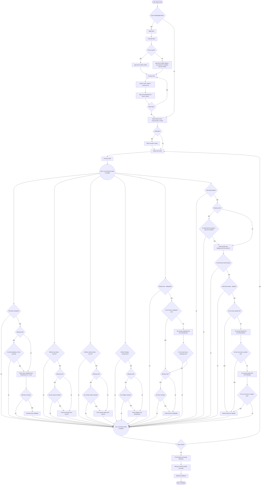

```mermaid
graph TD
    start([User Starts Scan]) --> scan_update{Scan & add/update files?}
    
    scan_update -->|yes| walk_files[Walk Files]
    walk_files --> load_db_state[Load db state]
    load_db_state --> force_rescan{Force rescan?}
    
    force_rescan -->|yes| remove_all_db[wipe db for folder all files]
    force_rescan -->|no| remove_up_del[wipe db for folder deletes -use upserts for updates and new tracks]

    remove_all_db --> process_file[Process File]
    remove_up_del --> process_file

    process_file --> upsert_db[Upsert Track / Album / Artist into db]
    upsert_db --> save_art[Save art extracted from files to cache]
    save_art --> more_files{More files?}

    more_files -->|yes| process_file
    more_files -->|no| build_artist_list[Build artist list from scanned files in folder]
    scan_update -->|no| build_artist_list

    build_artist_list --> artist_filter{Artist filter?}
    artist_filter -->|yes| apply_artist_filter[Filter records to artist]
    artist_filter -->|no| next_artist[Select next artist]
    apply_artist_filter --> next_artist


    %% ---- Artist loop cursor ----
    next_artist --> process_artist[Process artist]

    %% ---- Explicit parallel fork/join ----
    process_artist --> fork_parallel((Fork: run enrichment tasks in parallel))

    join_parallel((Join: enrichment tasks complete)) --> more_artist{More artists?}
    more_artist -->|yes| next_artist


    %% =========================
    %% MusicBrainz + Wikidata
    %% =========================
    fork_parallel --> pull_mb{Pull artist metadata?}
    pull_mb -->|no| join_parallel
    pull_mb -->|yes| missing_only_mb{Missing only?}
    missing_only_mb -->|yes| check_mb{Is artist metadata or links missing?}
    check_mb -->|no| join_parallel
    check_mb -->|yes| fetch_mb[Fetch artist metadata from Musicbrainz inc. Links]
    missing_only_mb -->|no| fetch_mb
    fetch_mb --> check_link{Still links missing?}
    check_link -->|no| join_parallel
    check_link -->|yes| pull_wd[Pull links from Wikidata]
    pull_wd --> join_parallel


    %% =========================
    %% Last.fm Top tracks
    %% =========================
    fork_parallel --> pull_lfm_top{Refresh top tracks - Last.fm?}
    pull_lfm_top -->|no| join_parallel
    pull_lfm_top -->|yes| missing_only_lfm_top{Missing only?}
    missing_only_lfm_top -->|yes| check_lfm_top{Are top tracks missing?}
    check_lfm_top -->|no| join_parallel
    check_lfm_top -->|yes| fetch_lfm_top[Fetch top tracks from Last.fm]
    missing_only_lfm_top -->|no| fetch_lfm_top
    fetch_lfm_top --> join_parallel


    %% =========================
    %% Last.fm Similar artists
    %% =========================
    fork_parallel --> pull_lfm_sim{Refresh similar artists - Last.fm?}
    pull_lfm_sim -->|no| join_parallel
    pull_lfm_sim -->|yes| missing_only_lfm_sim{Missing only?}
    missing_only_lfm_sim -->|yes| check_lfm_sim{Are similar artists missing?}
    check_lfm_sim -->|no| join_parallel
    check_lfm_sim -->|yes| fetch_lfm_sim[Fetch similar artists from Last.fm]
    missing_only_lfm_sim -->|no| fetch_lfm_sim
    fetch_lfm_sim --> join_parallel


    %% =========================
    %% MusicBrainz Singles
    %% =========================
    fork_parallel --> pull_mb_singles{Refresh Singles - Musicbrainz?}
    pull_mb_singles -->|no| join_parallel
    pull_mb_singles -->|yes| missing_only_mb_singles{Missing only?}
    missing_only_mb_singles -->|yes| check_mb_singles{Are Singles missing?}
    check_mb_singles -->|no| join_parallel
    check_mb_singles -->|yes| fetch_mb_singles[Fetch Singles from Musicbrainz]
    missing_only_mb_singles -->|no| fetch_mb_singles
    fetch_mb_singles --> join_parallel


    %% =========================
    %% Wikipedia Bio
    %% =========================
    fork_parallel --> pull_bio{Refresh bio - Wikipedia?}
    pull_bio -->|no| join_parallel
    pull_bio -->|yes| have_wiki_link{Do we have a wikipedia link?}

    have_wiki_link -->|yes| missing_only_bio{Missing only?}
    have_wiki_link -->|no| get_wikilink[Try and get wikipedia link from Musicbrainz]
    get_wikilink --> have_wiki_link2{Do we now have a wikipedia link?}
    have_wiki_link2 -->|no| join_parallel
    have_wiki_link2 -->|yes| missing_only_bio

    missing_only_bio -->|yes| check_bio{Are bios missing?}
    check_bio -->|no| join_parallel
    check_bio -->|yes| fetch_bio[Fetch bio from wikipedia]
    missing_only_bio -->|no| fetch_bio
    fetch_bio --> join_parallel


    %% =========================
    %% Artwork (Fanart + Spotify fallback)
    %% =========================
    fork_parallel --> pull_art{Pull artist artwork?}
    pull_art -->|no| join_parallel
    pull_art -->|yes| missing_only_art{Missing only?}

    missing_only_art -->|yes| check_art{Is artist thumb missing or only from Spotify?}
    check_art -->|no| join_parallel
    check_art -->|yes| fetch_art[Fetch thumb and background from fanart.tv]
    missing_only_art -->|no| fetch_art

    fetch_art --> check_art2{Is artist thumb still missing?}
    check_art2 -->|no| join_parallel
    check_art2 -->|yes| pull_art_spot{Pull artist artwork - Spotify?}

    pull_art_spot -->|no| join_parallel
    pull_art_spot -->|yes| have_link_spot{Do we have spotify link?}

    have_link_spot -->|yes| fetch_art_spot[Fetch thumb from Spotify]
    have_link_spot -->|no| get_spot_link_mb[Try and get spotify link from Musicbrainz]
    get_spot_link_mb --> have_link_spot2{Do we now have a spotify link?}

    have_link_spot2 -->|yes| fetch_art_spot
    have_link_spot2 -->|no| get_spot_link_wd[Try and get spotify link from Wikidata]
    get_spot_link_wd --> have_link_spot3{Do we now have a spotify link?}

    have_link_spot3 -->|yes| fetch_art_spot
    have_link_spot3 -->|no| join_parallel
    fetch_art_spot --> join_parallel


    %% ---- After artist loop completes ----
    more_artist -->|no| prune_lib[Prune library of missing elements]
    prune_lib --> orphan_art[Remove orphan artwork from disk]
    orphan_art --> opt_db[Optimise Database]
    opt_db --> theend([Scan Complete])
```

