# Scanner Specification & Flowchart

## Overview

The Jamarr scanner is responsible for synchronizing the local music library filesystem with the database and enriching it with metadata from external sources. It operates in distinct phases: **Filesystem Scan**, **Metadata Update**, and **Prune**.

### 1. Filesystem Scan ([start_scan](file:///root/code/jamarr/app/scanner/scan_manager.py#125-139) / [scan_filesystem](file:///root/code/jamarr/app/scanner/core.py#52-360))

**Condition**: Triggered **ONLY** if "Scan & add/update files" is checked.
**Primary Constraint**: Target Folder ([path](file:///root/code/jamarr/app/scanner/scan_manager.py#58-60) argument). All operations are strictly scoped to this directory.

1.  **Scope**: Determine `root_path` (Target Folder).
2.  **Force Check / Clean**:
    *   **IF Force = True**:
        *   **Wipe All**: Delete ALL records tied to files in `root_path`. This includes tracks, albums, artist junctions, top track links, and artwork mappings. It should be as if these files were never loaded.
        *   **Action**: Process all files in folder as NEW.
    *   **IF Force = False**:
        *   **Wipe Deletes**: Identify files in DB for this folder that are no longer on disk. Delete them and their relations.
        *   **Action**: Walk folder. Use **Upsert** logic to insert new files or update existing ones (timestamp check handled helper-side).

3. File Change Detection Strategy

To efficiently and reliably detect file changes without incurring the cost of full-file hashing, the scanner uses a **composite change signature** derived from inexpensive filesystem attributes and a lightweight content hash.

#### Stored Change Signature

Each track record MUST store the following fields:

- **`mtime`**  
  Last modification timestamp of the file (filesystem mtime).

- **`size_bytes`**  
  File size in bytes.

- **`quick_hash`**  
  A fast content hash computed from a small, fixed subset of the file:

  ```
  quick_hash = hash(first 64KB of file + last 64KB of file)
  ```

  - If the file is smaller than 128KB, the entire file is hashed.
  - The hash algorithm SHOULD be a fast, non-cryptographic hash  
    (e.g. xxHash, BLAKE3 in streaming mode, or SHA-1 if simplicity is preferred).

Together, these values form the **file scan signature**.

---

#### Change Detection Rules

During filesystem scans, a file is considered **unchanged** if and only if **all** of the following match the stored database values:

- `mtime`
- `size_bytes`
- `quick_hash`

A file is considered **changed** and MUST be reprocessed if **any** of the following are true:

- `mtime` differs
- `size_bytes` differs
- `quick_hash` differs
- No existing database record exists for the file path

This strategy reliably detects:

- Standard file modifications
- File replacements restored from backup
- Content changes that preserve file size
- Edge cases where mtime is preserved but file contents differ

---

#### Scan Behaviour

- The scanner MUST always read `mtime` and `size_bytes` from the filesystem.
- `quick_hash` MUST be computed only when:
  - The file is new, or
  - `mtime` or `size_bytes` differ from stored values, or
  - No stored `quick_hash` exists (legacy records)

This minimises I/O while maintaining strong correctness guarantees.

---

#### Database Persistence

The following columns MUST exist on the `tracks` table (or equivalent):

- `mtime`
- `size_bytes`
- `quick_hash`

These values MUST be updated atomically whenever a track is reprocessed.

---

#### Rationale

This approach provides a balance between performance and correctness:

- Avoids full-file hashing, which is I/O-expensive on large libraries.
- Stronger than mtime-only detection, especially on network filesystems.
- Deterministic and idempotent across repeated scans.
- Compatible with manual, scheduled, and forced rescan workflows.

---

#### Explicit Non-Goals

- The scanner does **not** rely on filesystem event watchers.
- The scanner does **not** compute cryptographic hashes of entire media files.
- The scanner does **not** use tag-only signatures to decide whether a file should be opened.

4.  **Process File (Upsert)**:
    *   **Extract Tags**: Read metadata (Artist, Title, Album, MBIDs, etc.) using `mutagen`.
    *   **Extract Artwork**: Check for **embedded art only** (from tags). Do not scan disk for cover images.
    *   **Upsert DB**: Insert/Update [track](file:///root/code/jamarr/app/scanner/core.py#2051-2086), [album](file:///root/code/jamarr/app/scanner/core.py#2087-2240), [artist](file:///root/code/jamarr/app/scanner/core.py#361-394) tables.
    *   **Link Entities**: Update [track_artist](file:///root/code/jamarr/app/scanner/core.py#753-979), `artist_album` junction tables.
    *   **Fuzzy Match Top Tracks**: Link to external top tracks data if available.

### 2. Metadata Update ([start_metadata_update](file:///root/code/jamarr/app/scanner/scan_manager.py#182-226) / [update_metadata](file:///root/code/jamarr/app/scanner/core.py#1137-1578))

**Input Source**:
*   **If Filesystem Scanned**: List of artists found/modified during the scan.
*   **If Filesystem Skipped**: List of **Artists associated with the target folder** (via DB query).
*   **Filter**: Apply `artist_filter` / `mbid_filter` to this list.

**Process**:
1.  **Iterate Artists**: For each artist in the filtered list...
2.  **Fork Parallel Tasks**: Run the following enrichment branches concurrently (as per diagram):
    *   **Branch 1 (Metadata & Links)**:
        *   Fetch Core Metadata from **MusicBrainz**.
        *   *Check*: Are links still missing?
        *   *If Yes*: Fetch Links from **Wikidata**.
    *   **Branch 2 (Singles)**:
        *   Fetch Singles from **MusicBrainz**.
    *   **Branch 3 (Top Tracks)**:
        *   Fetch Top Tracks from **Last.fm**.
    *   **Branch 4 (Similar Artists)**:
        *   Fetch Similar Artists from **Last.fm**.
    *   **Branch 5 (Bio)**:
        *   Fetch Bio from **Wikipedia**. (Logic includes fallback to find Wiki link via MB if missing).
    *   **Branch 6 (Artwork)**:
        *   Fetch Artwork from **Fanart.tv**.
        *   *Check*: Is artwork still missing?
        *   *If Yes*: Fetch Artwork from **Spotify** (fallback).
3.  **Join & Update**: Aggregate results from all branches and update DB.

### 3. Prune ([start_prune](file:///root/code/jamarr/app/scanner/scan_manager.py#527-539) / [prune_library](file:///root/code/jamarr/app/scanner/core.py#1015-1136))

*Note: This acts as a Global/Final cleanup.*

1.  **Prune Library**: Remove missing elements (orphaned artists/albums).
2.  **Orphan Artwork**: Remove artwork files not referenced in DB.
3.  **Optimize DB**: Perform database optimization/vacuum.

## API Definitions

The backend must expose the following endpoints to determine the scan lifecycle.

### 1. Start Scan (`POST /api/scanner/start`)

**Request Body (JSON)**:
```json
{
  "path": "/mnt/music/Rock",       // Required. Target folder.
  "scan_filesystem": true,         // Toggle Phase 1
  "force_rescan": false,           // Toggle Force Clean
  "missing_only": true,            // Toggle Missing Only (Phase 2 constraint)
  "artist_filter": "Metallica",    // Optional string filter
  "options": {                     // Enrichment Toggles
    "fetch_metadata": true,        // Branch 1
    "refresh_singles": true,       // Branch 2
    "refresh_top_tracks": true,    // Branch 3
    "refresh_similar_artists": true, // Branch 4
    "refresh_bio": true,           // Branch 5
    "fetch_artwork": true          // Branch 6
  }
}
```

**Response (200 OK)**:
```json
{
  "status": "started",
  "scan_id": "12345-abcde",
  "message": "Scan started for /mnt/music/Rock"
}
```
*Returns 409 Conflict if a scan is already running.*

### 2. Cancel Scan (`POST /api/scanner/cancel`)

**Request Body**: None

**Response (200 OK)**:
```json
{
  "status": "cancelled",
  "message": "Cancellation requested"
}
```

### 3. Scan Events (`GET /api/scanner/events`)

**Type**: Server-Sent Events (SSE)

**Payload Structure (Event: `progress`)**:
```json
{
  "status": "scanning",           // "idle", "scanning", "metadata", "pruning"
  "phase": "filesystem",          // Current granular phase
  "progress_current": 455,
  "progress_total": 1000,
  "current_item": "Metallica - Enter Sandman.mp3", // File or Artist name being processed
  "processed_counts": {
    "tracks": 150,
    "albums": 12,
    "artists": 5
  },
  "api_stats": {
    "musicbrainz": 45,
    "fanart": 12,
    "lastfm": 30,
    "wikidata": 5,
    "wikipedia": 2,
    "spotify": 0
  }
}
```

**Field Descriptions**:
*   `processed_counts`: Cumulative counts of items added/updated in the DB.
*   `api_stats`: Real-time counter of external API hits per service (used for rate-limit monitoring and UI feedback).

## Frontend Requirements

To support this flow, the frontend must provide the following inputs:

### Controls
| Control | Type | Dependency | Description |
| :--- | :--- | :--- | :--- |
| **Library Path** | Text Input | - | Target directory for the operation. |
| **Scan & add/update files?** | Checkbox | - | Toggles the Filesystem Scan phase. |
| **Force Rescan** | Checkbox | Enabled if Scan=True | If Checked: Wipes DB for folder before scan. |
| **Missing Only** | Checkbox | - | If Checked: Enrichment tasks skipped if data already exists. |
| **Artist Filter** | Text Input | - | Optional regex/glob to filter artist list. |

### Enrichment Toggles
| Toggle | Backend Branch | Description |
| :--- | :--- | :--- |
| **Pull Artist Metadata** | Branch 1 | MB Core Metadata + Links (+ Wikidata fallback). |
| **Refresh Singles** | Branch 2 | Fetch Singles from MusicBrainz. |
| **Refresh Top Tracks** | Branch 3 | Fetch Top Tracks from Last.fm. |
| **Refresh Similar Artists** | Branch 4 | Fetch Similar Artists from Last.fm. |
| **Refresh Bio** | Branch 5 | Fetch Biography from Wikipedia. |
| **Pull Artist Artwork** | Branch 6 | Fetch Artwork (Fanart.tv > Spotify). |

## Backend Modules

### 1. `app.api.scan` (Router)
*   **`start_scan(request: ScanRequest)`**:
    *   **Input**: JSON payload matching `ScanRequest` schema.
    *   **Logic**: Validates input, checks if `ScanManager` is busy.
    *   **Output**: Calls `ScanManager.start()`, returns `scan_id`.
*   **`cancel_scan()`**:
    *   **Logic**: Triggers cancellation on the manager.
*   **`scan_events(request)`**:
    *   **Logic**: Establishes SSE connection, yielding status dicts from `ScanManager.event_generator()`.

### 2. `app.scanner.scan_manager` (Orchestrator)
*   **Class `ScanManager`**: Singleton state machine.
    *   **Attributes**: `_status` (str), `_stop_event` (Event), `_stats` (dict), `_api_stats` (dict).
    *   **`start(config)`**:
        *   Resets all stats counters.
        *   Sets status to "Starting".
        *   Spawns `_run_scan` as a background `asyncio.Task`.
    *   **`_run_scan(config)`**:
        *   **Phase 1 (Filesystem)**:
            *   Condition: `config.scan_filesystem == True`.
            *   Action: Call `Scanner.scan_filesystem(path, force)`.
            *   Events: Emits `phase="filesystem"`, `current_item=filename`.
        *   **Phase 2 (Metadata)**:
            *   Condition: Any enrichment option is `True`.
            *   Action:
                *   Retrieve artist list: **Optimized SQL Query**.
                *   Call `Scanner.get_artists_for_enrichment(config)`.
                *   Call `MetadataManager.update_metadata(artists, config)`.
            *   Events: Emits `phase="metadata"`, `current_item=artist_name`.
        *   **Phase 3 (Prune)**:
            *   Condition: Always checked (implicit or explicit).
            *   Action: Call `Scanner.prune_library()`.
            *   Events: Emits `phase="prune"`.
    *   **`broadcast_event()`**:
        *   Combines `current_item`, `processed_counts`, `api_stats` into SSE payload.

### 3. `app.scanner.core` (Filesystem & DB Logic)
*   **Class `Scanner`**:
    *   **`scan_filesystem(root_path, force)`**:
        *   **Force Logic**:
            *   `Force=True`: Executes `DELETE FROM ... WHERE path LIKE root_path%`.
            *   `Force=False`: Fetches full map of `{path: mtime}` from DB.
        *   **Walk Loop**:
            *   Iterates `os.walk`.
            *   Compares file mtime with DB cache.
            *   Queue `process_file` for new/changed items.
            *   Diffs sets to identify deleted files -> `delete_tracks(ids)`.
    *   **`process_file(file_path)`**:
        *   **Tag Reading**: Uses `mutagen`.
        *   **Validation**: Check `artist_mbid` and `release_group_mbid`. If None -> **Skip**.
        *   **Artwork**: Extracts APIC/CoverArt frames *only* (no disk scan). Hashes image data.
        *   **Upsert**: Standard track/album/artist logic.
    *   **`get_artists_for_enrichment(config)`**:
        *   Builds SQL `SELECT ... WHERE` clause based on:
            *   `config.path` (JOIN track).
            *   `config.missing_only` (check for NULL columns based on active flags).
            *   `config.artist_filter` (ILIKE).
    *   **`prune_library()`**:
        *   SQL: `DELETE FROM artist WHERE id NOT IN (SELECT artist_id FROM ...)`
        *   SQL: `DELETE FROM album WHERE id NOT IN (SELECT album_id FROM ...)`
        *   SQL: `DELETE FROM artwork WHERE id NOT IN (SELECT artwork_id FROM ...)`

### 4. `app.scanner.services` (Metadata Enrichment)

*Refactored from monolithic `metadata.py` into focused providers.
All services are MBID-keyed. Name-based lookups are never used once an external ID exists.*

---

#### A. `app.scanner.services.manager`

**Class `MetadataManager`**

##### `update_metadata(artist_list, options)`
- Creates an `asyncio.Semaphore` (concurrency limit, e.g. 5–10).
- Iterates artists and spawns `process_artist` tasks.

##### `process_artist(artist, options)`
- **Input**: `artist` object containing at minimum:
  - `artist_mbid`
  - resolved external IDs (Wikidata QID, Spotify Artist ID, Wikipedia URL if known)
- Orchestrates all enrichment branches using `asyncio.gather`.
- **All enrichment calls are keyed by MBID or derived external IDs only.**
- Aggregates results into a single update payload.
- Persists results atomically via `Scanner.save_artist_metadata(artist_id, data)`.

---

#### B. `app.scanner.services.musicbrainz`

**Primary authority for artist identity and external identifiers.**

##### `fetch_core(artist_mbid)`
- Fetches core artist metadata from MusicBrainz.
- Includes:
  - URL relationships (Spotify, Wikipedia, Wikidata, social links)
  - Genres / tags

##### `fetch_singles(artist_mbid)`
- Fetches Release Groups of type `Single` for the artist.

##### Rate limiting
- Enforced at **1 request per second**, per MusicBrainz TOS.

> MusicBrainz is the source of truth for resolving all downstream external identifiers.

---

#### C. `app.scanner.services.lastfm`

**Last.fm enrichment keyed by MusicBrainz Artist MBID.**

##### `fetch_top_tracks(artist_mbid)`
- Calls Last.fm APIs using the artist’s MBID.
- Returns ranked top tracks with playcount / listener metadata.

##### `fetch_similar(artist_mbid)`
- Calls Last.fm APIs using the artist’s MBID.
- Returns similar artists, mapped to MBIDs where available.

##### Mapping
- Top tracks are **fuzzy-matched to existing local tracks** only.
- Fuzzy matching is strictly limited to:
  - Track title
  - Duration
  - Track number (when available)

> Artist identity is never inferred from names; MBID is always authoritative.

---

#### D. `app.scanner.services.artwork`

**Artwork retrieval using externally resolved IDs only.**

##### `fetch_fanart(artist_mbid)`
- Uses MusicBrainz Artist MBID directly.
- Returns:
  - Artist thumb
  - Artist background

##### `fetch_spotify(spotify_artist_id)`
- Uses Spotify Artist ID **only**.
- No name-based search is performed.
- Extracts the highest-quality available artist image.

##### Fallback rules
1. Fanart.tv via MusicBrainz Artist MBID
2. Spotify **only if Spotify Artist ID is already known**
   - Spotify ID must originate from MusicBrainz or Wikidata
   - No search-by-name fallback is permitted

---

#### E. `app.scanner.services.wikipedia`

**Biography retrieval via resolved Wikipedia links only.**

##### `fetch_bio(wikipedia_url)`
- Fetches article summary and selected sections.
- Parses:
  - Lead section
  - “Early life”
  - “Career” (when present)

##### Resolution rules
- Wikipedia URL must be obtained via:
  1. MusicBrainz URL relationships
  2. Wikidata sitelinks

> No name-based Wikipedia search is performed.

---

#### F. `app.scanner.services.wikidata`

**Secondary authority for external identifiers when missing from MusicBrainz.**

##### `fetch_links(artist_mbid)`
- Resolves the Wikidata entity associated with the MusicBrainz Artist MBID.
- Extracts:
  - Spotify Artist ID
  - Wikipedia sitelinks
  - Social media identifiers

Used **only** when required external identifiers are missing from MusicBrainz.

---

## Identity & Keying Rules

- **MusicBrainz Artist MBID is the sole internal artist key**
- External services are accessed only via:
  - MusicBrainz Artist MBID
  - IDs resolved *from* MBID (Spotify ID, Wikidata QID, Wikipedia URL)
- **Artist names are never used for identity, joins, or external lookups**

## Decision Gates & Flowchart

```mermaid
graph TD
    start([User Starts Scan]) --> scan_update{Scan & add/update files?}
    
    scan_update -->|yes| walk_files[Walk Files]
    walk_files --> load_db_state[Load db state]
    load_db_state --> force_rescan{Force rescan?}
    
    force_rescan -->|yes| remove_all_db[wipe db for folder all files]
    force_rescan -->|no| remove_up_del[wipe db for folder deletes -use upserts for updates and new tracks]

    remove_all_db --> process_file[Process File]
    remove_up_del --> process_file

    process_file --> upsert_db[Upsert Track / Album / Artist into db]
    upsert_db --> save_art[Save art extracted from files to cache]
    save_art --> more_files{More files?}

    more_files -->|yes| process_file
    more_files -->|no| build_artist_list[Build artist list from scanned files in folder]
    scan_update -->|no| build_artist_list

    build_artist_list --> artist_filter{Artist filter?}
    artist_filter -->|yes| apply_artist_filter[Filter records to artist]
    artist_filter -->|no| next_artist[Select next artist]
    apply_artist_filter --> next_artist


    %% ---- Artist loop cursor ----
    next_artist --> process_artist[Process artist]

    %% ---- Explicit parallel fork/join ----
    process_artist --> fork_parallel((Fork: run enrichment tasks in parallel))

    join_parallel((Join: enrichment tasks complete)) --> more_artist{More artists?}
    more_artist -->|yes| next_artist


    %% =========================
    %% MusicBrainz + Wikidata
    %% =========================
    fork_parallel --> pull_mb{Pull artist metadata?}
    pull_mb -->|no| join_parallel
    pull_mb -->|yes| missing_only_mb{Missing only?}
    missing_only_mb -->|yes| check_mb{Is artist metadata or links missing?}
    check_mb -->|no| join_parallel
    check_mb -->|yes| fetch_mb[Fetch artist metadata from Musicbrainz inc. Links]
    missing_only_mb -->|no| fetch_mb
    fetch_mb --> check_link{Still links missing?}
    check_link -->|no| join_parallel
    check_link -->|yes| pull_wd[Pull links from Wikidata]
    pull_wd --> join_parallel


    %% =========================
    %% Last.fm Top tracks
    %% =========================
    fork_parallel --> pull_lfm_top{Refresh top tracks - Last.fm?}
    pull_lfm_top -->|no| join_parallel
    pull_lfm_top -->|yes| missing_only_lfm_top{Missing only?}
    missing_only_lfm_top -->|yes| check_lfm_top{Are top tracks missing?}
    check_lfm_top -->|no| join_parallel
    check_lfm_top -->|yes| fetch_lfm_top[Fetch top tracks from Last.fm]
    missing_only_lfm_top -->|no| fetch_lfm_top
    fetch_lfm_top --> join_parallel


    %% =========================
    %% Last.fm Similar artists
    %% =========================
    fork_parallel --> pull_lfm_sim{Refresh similar artists - Last.fm?}
    pull_lfm_sim -->|no| join_parallel
    pull_lfm_sim -->|yes| missing_only_lfm_sim{Missing only?}
    missing_only_lfm_sim -->|yes| check_lfm_sim{Are similar artists missing?}
    check_lfm_sim -->|no| join_parallel
    check_lfm_sim -->|yes| fetch_lfm_sim[Fetch similar artists from Last.fm]
    missing_only_lfm_sim -->|no| fetch_lfm_sim
    fetch_lfm_sim --> join_parallel


    %% =========================
    %% MusicBrainz Singles
    %% =========================
    fork_parallel --> pull_mb_singles{Refresh Singles - Musicbrainz?}
    pull_mb_singles -->|no| join_parallel
    pull_mb_singles -->|yes| missing_only_mb_singles{Missing only?}
    missing_only_mb_singles -->|yes| check_mb_singles{Are Singles missing?}
    check_mb_singles -->|no| join_parallel
    check_mb_singles -->|yes| fetch_mb_singles[Fetch Singles from Musicbrainz]
    missing_only_mb_singles -->|no| fetch_mb_singles
    fetch_mb_singles --> join_parallel


    %% =========================
    %% Wikipedia Bio
    %% =========================
    fork_parallel --> pull_bio{Refresh bio - Wikipedia?}
    pull_bio -->|no| join_parallel
    pull_bio -->|yes| have_wiki_link{Do we have a wikipedia link?}

    have_wiki_link -->|yes| missing_only_bio{Missing only?}
    have_wiki_link -->|no| get_wikilink[Try and get wikipedia link from Musicbrainz]
    get_wikilink --> have_wiki_link2{Do we now have a wikipedia link?}
    have_wiki_link2 -->|no| join_parallel
    have_wiki_link2 -->|yes| missing_only_bio

    missing_only_bio -->|yes| check_bio{Are bios missing?}
    check_bio -->|no| join_parallel
    check_bio -->|yes| fetch_bio[Fetch bio from wikipedia]
    missing_only_bio -->|no| fetch_bio
    fetch_bio --> join_parallel


    %% =========================
    %% Artwork (Fanart + Spotify fallback)
    %% =========================
    fork_parallel --> pull_art{Pull artist artwork?}
    pull_art -->|no| join_parallel
    pull_art -->|yes| missing_only_art{Missing only?}

    missing_only_art -->|yes| check_art{Is artist thumb missing or only from Spotify?}
    check_art -->|no| join_parallel
    check_art -->|yes| fetch_art[Fetch thumb and background from fanart.tv]
    missing_only_art -->|no| fetch_art

    fetch_art --> check_art2{Is artist thumb still missing?}
    check_art2 -->|no| join_parallel
    check_art2 -->|yes| pull_art_spot{Pull artist artwork - Spotify?}

    pull_art_spot -->|no| join_parallel
    pull_art_spot -->|yes| have_link_spot{Do we have spotify link?}

    have_link_spot -->|yes| fetch_art_spot[Fetch thumb from Spotify]
    have_link_spot -->|no| get_spot_link_mb[Try and get spotify link from Musicbrainz]
    get_spot_link_mb --> have_link_spot2{Do we now have a spotify link?}

    have_link_spot2 -->|yes| fetch_art_spot
    have_link_spot2 -->|no| get_spot_link_wd[Try and get spotify link from Wikidata]
    get_spot_link_wd --> have_link_spot3{Do we now have a spotify link?}

    have_link_spot3 -->|yes| fetch_art_spot
    have_link_spot3 -->|no| join_parallel
    fetch_art_spot --> join_parallel


    %% ---- After artist loop completes ----
    more_artist -->|no| prune_lib[Prune library of missing elements]
    prune_lib --> orphan_art[Remove orphan artwork from disk]
    orphan_art --> opt_db[Optimise Database]
    opt_db --> theend([Scan Complete])
```


