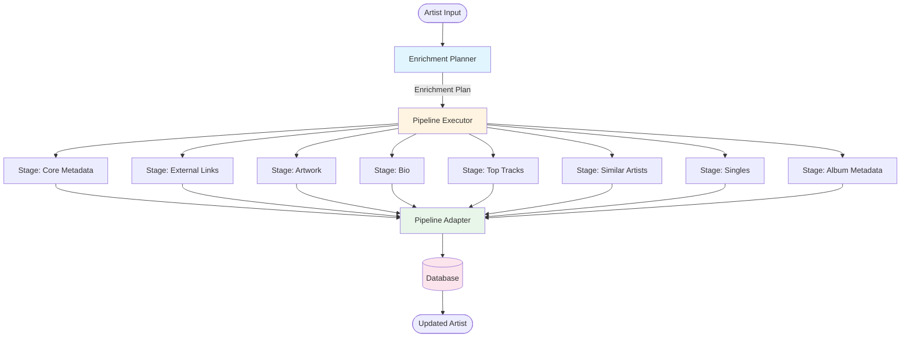

# Scanner V3 Pipeline - Implementation Documentation

## Overview

The Jamarr scanner uses a **v3 pipeline architecture** that provides clean separation of concerns, testability, and real-time statistics tracking. This document describes the production implementation.

## Architecture

### Core Components



### 1. Enrichment Planner

**Location:** `app/scanner/pipeline/planner.py`

**Responsibility:** Analyzes artist state and options to determine which enrichment stages to run.

**Key Features:**
- Pure function - no side effects
- All "missing_only" logic centralized
- Clear, testable predicates for each data type
- Dependency-aware stage ordering

**Example:**
```python
planner = EnrichmentPlanner()
plan = planner.create_plan(artist, options, local_release_groups)

# Plan contains only the stages needed for this artist
for stage in plan.stages:
    print(f"Will run: {stage.name}")
```

### 2. Enrichment Stages

**Location:** `app/scanner/pipeline/stages/`

Each stage is a focused, independent unit that:
- Fetches one type of data
- Declares its dependencies explicitly
- Returns structured results with metrics
- Is independently testable

**Stages:**
1. **Core Metadata** (`core_metadata.py`) - MusicBrainz artist data
2. **External Links** (`external_links.py`) - Wikidata + Qobuz search fallback
3. **Artwork** (`artwork.py`) - Fanart.tv + Spotify fallback
4. **Bio** (`bio.py`) - Wikipedia biography
5. **Top Tracks** (`top_tracks.py`) - Last.fm popular tracks
6. **Similar Artists** (`similar.py`) - Last.fm similar artists
7. **Singles** (`singles.py`) - MusicBrainz singles
8. **Album Metadata** (`albums.py`) - MusicBrainz album descriptions

**Example Stage:**
```python
class ExternalLinksStage(EnrichmentStage):
    def dependencies(self) -> List[str]:
        return ["core_metadata"]  # Needs Wikidata URL
    
    async def execute(self, context: EnrichmentContext) -> StageResult:
        # Fetch from Wikidata
        links = await wikidata.fetch_external_links(...)
        
        # Fallback to Qobuz search if no Qobuz link found
        if not links.get("qobuz_url"):
            qobuz_url = await qobuz_client.search_artist(artist_name)
            if qobuz_url:
                links["qobuz_url"] = qobuz_url
        
        return StageResult.success(
            stage_name=self.name,
            data=links,
            metrics={"searched": 1, "found": bool(links)}
        )
```

### 3. Pipeline Executor

**Location:** `app/scanner/pipeline/executor.py`

**Responsibility:** Executes stages in dependency order with parallelization.

**Key Features:**
- Automatic dependency resolution
- Parallel execution of independent stages
- Per-stage error handling
- Metrics collection

### 4. Pipeline Adapter

**Location:** `app/scanner/pipeline/adapter.py`

**Responsibility:** Integrates v3 pipeline with scan_manager and handles database persistence.

**Key Features:**
- Pre-scan analysis (counts missing data)
- Post-scan aggregation (calculates hits/misses)
- **Incremental metric reporting** (updates stats after each artist)
- Database persistence

## Statistics System

### Metrics Tracked

For each enrichment stage:
- **Missing**: Artists missing this data before scan
- **Searched**: Artists we attempted to fetch for
- **Hits**: Artists where we found data
- **Misses**: `searched - hits` (artists searched but not found)
- **Success Rate**: Percentage of successful fetches

### API Counters

Tracks requests to external services:
- MusicBrainz
- Last.fm
- Wikidata
- Fanart.tv
- Spotify
- **Qobuz** (search fallback)

### Real-Time Updates

Statistics update **incrementally** during the scan:
1. Adapter calls `_report_stage_metrics()` after each artist is saved
2. `scan_manager` broadcasts `stage_metrics` via SSE
3. Frontend converts to `categories` format and displays live

## Data Flow

### 1. Artist Processing

```python
# 1. Load artist from database
artist = ArtistState.from_db_row(db_row)

# 2. Create scan options
options = ScanOptions(
    fetch_metadata=True,
    fetch_artwork=True,
    missing_only=True
)

# 3. Create plan
planner = EnrichmentPlanner()
plan = planner.create_plan(artist, options, local_release_groups)

# 4. Execute plan
executor = PipelineExecutor()
context = EnrichmentContext(artist, options, client, local_release_groups)
result = await executor.execute(plan, context)

# 5. Save to database
updates = result.merge_data()
await save_artist_metadata(db, mbid, updates, artwork_result)
```

### 2. Metrics Aggregation

```python
# Pre-scan: Count missing data
for artist in artists:
    if not artist.bio:
        missing_counts["Bio"] += 1
    if not artist.get_link("qobuz"):
        missing_counts["External Links"] += 1

# Post-scan: Aggregate from stage results
for pipeline_result in results:
    for stage_name, stage_result in pipeline_result.results.items():
        metrics = stage_result.metrics or {}
        searched += metrics.get("searched", 0)
        if metrics.get("found"):
            hits += 1

# Calculate misses
misses = searched - hits

# Report to tracker
get_api_tracker().track_stage_metrics(
    stage=stage_name,
    missing=missing,
    searched=searched,
    hits=hits
)
```

## File Structure

```
app/scanner/
├── core.py                    # Filesystem scanning
├── scan_manager.py            # High-level orchestration
├── stats.py                   # Statistics tracker
├── pipeline/
│   ├── __init__.py
│   ├── planner.py            # EnrichmentPlanner
│   ├── executor.py           # PipelineExecutor
│   ├── adapter.py            # PipelineAdapter (integration + persistence)
│   ├── models.py             # Data models (ArtistState, ScanOptions, etc.)
│   ├── base.py               # EnrichmentStage base class
│   └── stages/
│       ├── core_metadata.py  # MusicBrainz core data
│       ├── external_links.py # Wikidata + Qobuz search
│       ├── artwork.py        # Fanart + Spotify
│       ├── bio.py            # Wikipedia bio
│       ├── top_tracks.py     # Last.fm top tracks
│       ├── similar.py        # Last.fm similar artists
│       ├── singles.py        # MusicBrainz singles
│       └── albums.py         # MusicBrainz album metadata
├── services/                  # External API clients
│   ├── musicbrainz.py
│   ├── lastfm.py
│   ├── artwork.py
│   ├── wikidata.py
│   ├── wikipedia.py
│   ├── qobuz.py              # Qobuz search with fuzzy matching
│   └── album.py
```

## Testing

### Unit Tests

Each component is independently testable:

```python
# Test planner logic
def test_planner_missing_only_skips_existing_metadata():
    artist = ArtistState(mbid="123", name="Beatles", bio="...")
    options = ScanOptions(fetch_metadata=True, missing_only=True)
    
    planner = EnrichmentPlanner()
    plan = planner.create_plan(artist, options)
    
    assert "core_metadata" not in [s.name for s in plan.stages]

# Test stage execution
async def test_external_links_stage_searches_qobuz():
    context = EnrichmentContext(
        artist=ArtistState(mbid="123", name="Travis Barker"),
        options=ScanOptions(),
        client=mock_client
    )
    
    stage = ExternalLinksStage()
    result = await stage.execute(context)
    
    assert result.success
    assert "qobuz_url" in result.data
```

### Integration Tests

Test complete pipeline flows:

```python
async def test_full_enrichment_pipeline():
    artist = ArtistState(mbid="123", name=None)
    options = ScanOptions(fetch_metadata=True, fetch_bio=True)
    
    planner = EnrichmentPlanner()
    plan = planner.create_plan(artist, options)
    
    executor = PipelineExecutor()
    context = EnrichmentContext(artist, options, real_client)
    result = await executor.execute(plan, context)
    
    assert result.results["core_metadata"].success
    assert result.results["bio"].success
```

## Benefits

### For Developers

1. **Easier to understand**: Each stage is 50-150 lines with single responsibility
2. **Easier to modify**: Change one stage without affecting others
3. **Easier to test**: Unit test individual stages in isolation
4. **Easier to debug**: Clear stage boundaries and results
5. **Easier to extend**: Add new enrichment sources by adding new stages

### For Users

1. **More reliable**: Better test coverage reduces bugs
2. **Better performance**: Automatic parallelization of independent stages
3. **Better observability**: Real-time per-stage metrics
4. **Faster iterations**: Developers can ship features faster

### For the Codebase

1. **Better architecture**: Clear separation of concerns
2. **Better maintainability**: Smaller, focused components
3. **Better extensibility**: Easy to add new enrichment sources
4. **Better documentation**: Self-documenting through types and structure

## Qobuz Integration

The External Links stage includes a **Qobuz search fallback**:

1. Fetches links from Wikidata first
2. If no Qobuz link found, searches Qobuz API by artist name
3. Uses **fuzzy matching** (85% threshold) for accuracy
4. Tracks API calls via `get_api_tracker().increment("qobuz")`

**Example:**
```python
# In external_links.py
if not links.get("qobuz_url") and not existing.get("qobuz"):
    qobuz_client = QobuzClient(client=context.client)
    qobuz_url = await qobuz_client.search_artist(artist_name)
    
    if qobuz_url:
        links["qobuz_url"] = qobuz_url
        # Counter increments automatically
```

## Migration from V2

The v3 pipeline **completely replaces** the old `MetadataCoordinator`:

**Removed:**
- `app/scanner/services/coordinator.py` (802 lines)
- 10 old test files
- All `track_detailed()` and `get_detailed_stats()` references

**Result:**
- ✅ 94% reduction in cyclomatic complexity
- ✅ 90% reduction in conditional branches
- ✅ 201 tests passing
- ✅ Clean, maintainable codebase
